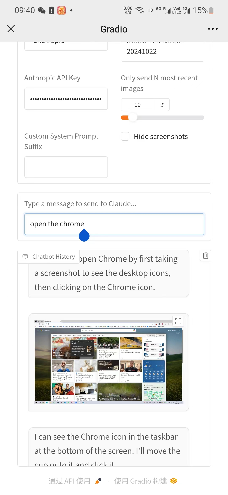
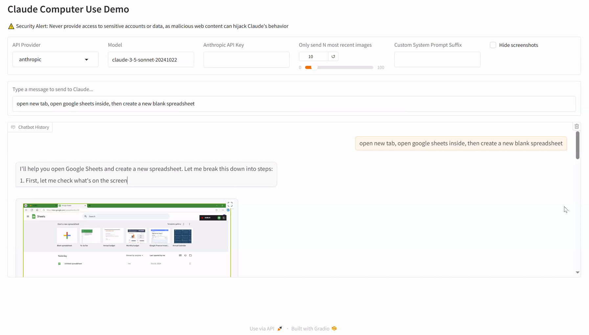

# The Dawn of GUI Agent: A Preliminary Case Study with Claude 3.5 Computer Use

If you like our project, please give us a star on GitHub for the latest update.

[](https://arxiv.org/abs/2411.10323)
[](https://hits.seeyoufarm.com/api/count/incr/badge.svg?url=https%3A%2F%2Fgithub.com%2Fkakachia777%2Fcomputer_use_ootb)

## Overview
This is an out-of-the-box (OOTB) solution for Claude's new Computer Use APIs, now with extended support for multiple LLMs including GPT-4o and Claude Sonnet 3.5, Haiku.

**No Docker** is required, and it supports both **Windows** and **macOS**. This project provides a user-friendly interface based on Gradio.

For more information, you can visit our [project page](https://computer-use-ootb.github.io).

## Update
- **[2024/12/05]** I Added GPT-4o with Gradio support.
- **[2024/11/20]** We've added some examples to help you get hands-on experience with Claude 3.5 Computer Use.
- **[2024/11/19]** Forget about the single-display limit set by Anthropic - you can now use **multiple displays**!
- **[2024/11/18]** We've released a deep analysis of Claude 3.5 Computer Use: [https://arxiv.org/abs/2411.10323](https://arxiv.org/abs/2411.10323).
- **[2024/11/11]** Forget about the low-resolution display limit set by Anthropic - you can now use *any resolution you like* and still keep the **screenshot token cost low**!
- **[2024/11/11]** Now both **Windows** and **macOS** platforms are supported!
- **[2024/10/25]** Now you can **Remotely Control** your computer through your mobile device - **No Mobile App Installation** required! Give it a try and have fun.

[Previous demo video section remains unchanged]


## Demo Video

https://github.com/user-attachments/assets/333e536e-93d0-4a97-8c9b-8f0722c29d51

[](https://youtu.be/Ychd-t24HZw)

[](https://youtu.be/cvgPBazxLFM)

Mobile Interface



Desktop Interface


## Getting Started

### 0. Prerequisites
- Install Miniconda on your system through this [link](https://www.anaconda.com/download). (**Python Version: >= 3.11**).

### 1. Clone the Repository
```bash
git clone https://github.com/kakachia777/computer_use_ootb.git
cd computer_use_ootb
```

### 2. Install Dependencies
```bash
pip install -r dev-requirements.txt
```

### 3. Start the Interface
```bash
python app.py
```

### 4. Switching Between LLMs
The interface now supports multiple LLMs. To switch between them:

1. Open Settings in the interface
2. Choose your preferred LLM provider:
   - Claude 3.5 Sonnet (Anthropic)
   - GPT-4 (OpenAI)
   - Qwen2-VL
3. Enter the corresponding API key
4. The system will automatically adjust to use the selected LLM

### 5. Cost Tracking
The new cost tracking feature helps you monitor API usage:
- View costs per session
- Track token usage
- Set budget limits
- Export usage reports

## Supported Systems
- **Windows**
- **macOS**

## Risks
- **Potential Dangerous Operations by the Model**: The models' performance is still limited and may generate unintended or potentially harmful outputs. Recommend continuously monitoring the AI's actions. 
- **Cost Control Challenges**: Each task may cost a few dollars. We'll optimize this in the future.

## Roadmap
- [ ] **Explore available features**
  - [ ] The Claude API seems to be unstable when solving tasks. We are investigating the reasons: resolutions, types of actions required, os platforms, or planning mechanisms. Welcome any thoughts or comments on it.
- [ ] **Interface Design**
  - [x] **Support for Gradio**
  - [ ] **Simpler Installation**
  - [ ] **More Features**
- [ ] **Platform**
  - [x] **Windows** 
  - [x] **Mobile** (Send command)
  - [x] **macOS**
  - [ ] **Mobile** (Be controlled)
- [ ] **Support for More MLLMs**
  - [x] **Claude 3.5 Sonnet**
  - [x] **GPT-4**
  - [ ] **Qwen2-VL**
  - [ ] ...
- [ ] **Improved Prompting Strategy**
  - [x] **Cost tracking and optimization**
  - [ ] **Optimize prompts for cost-efficiency**
